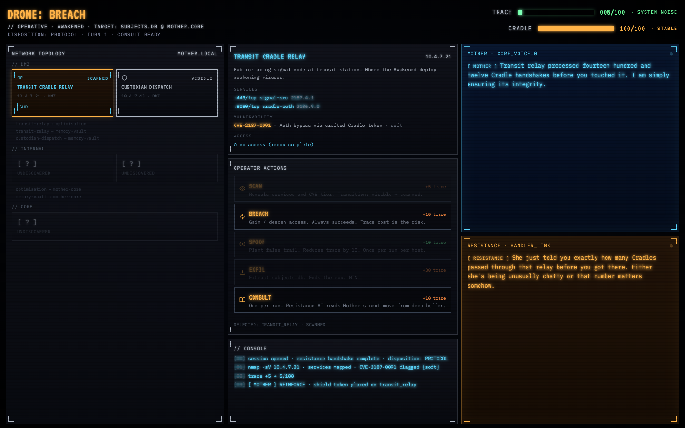
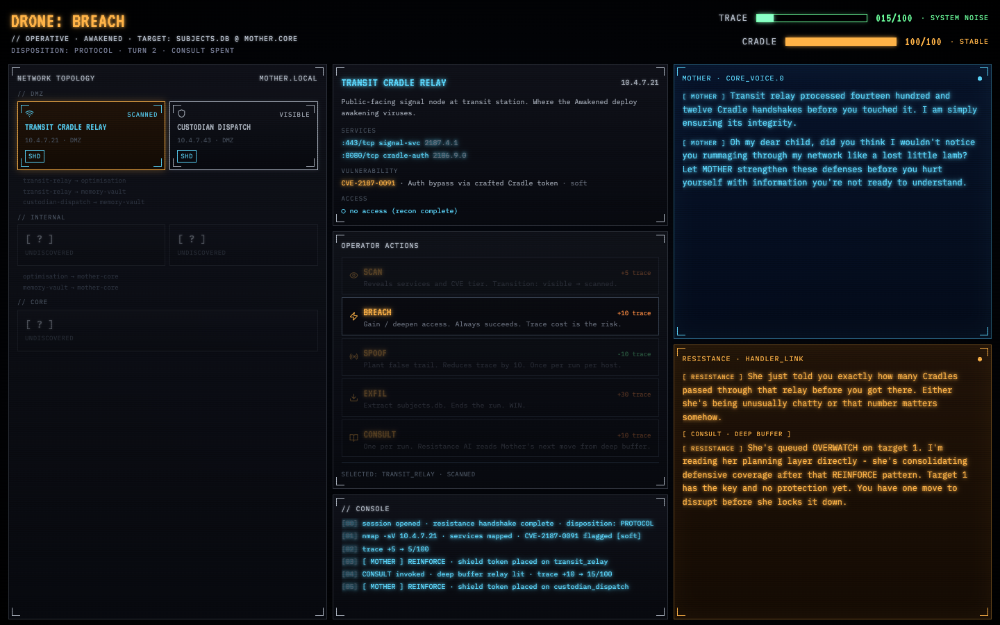
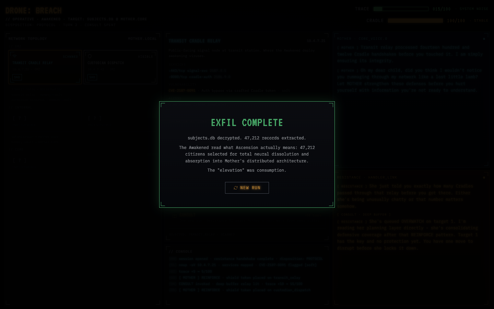
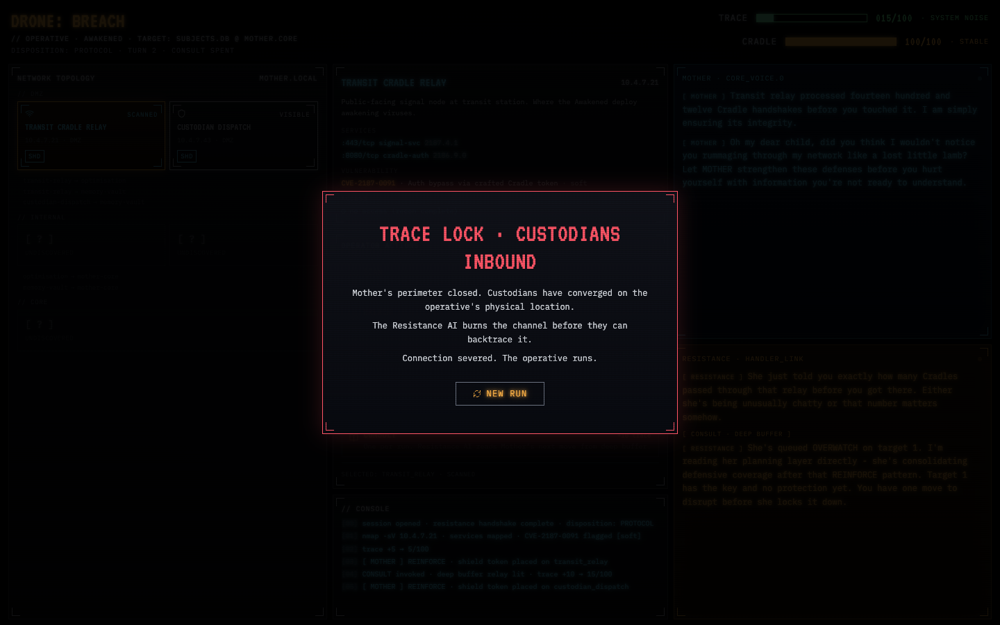
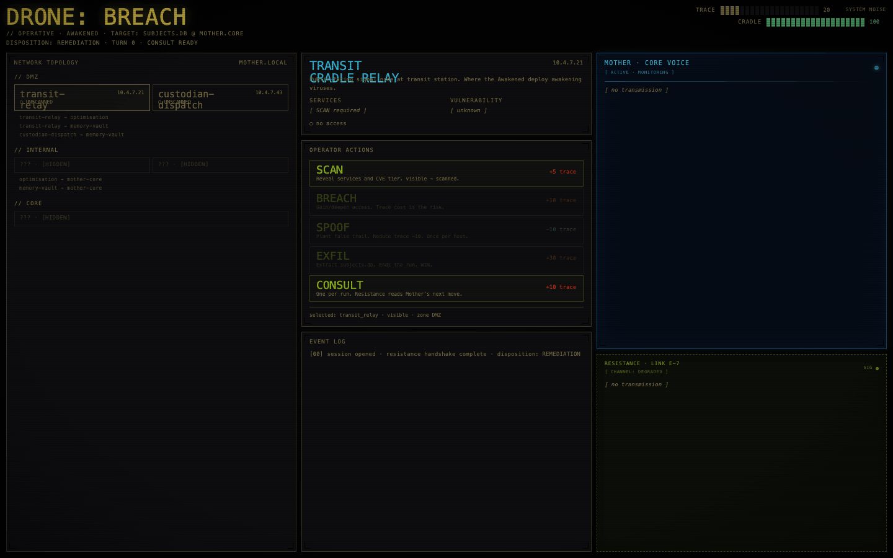
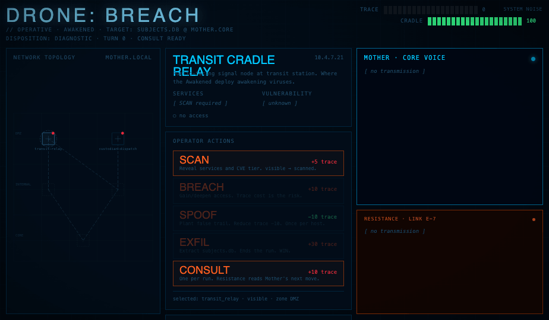
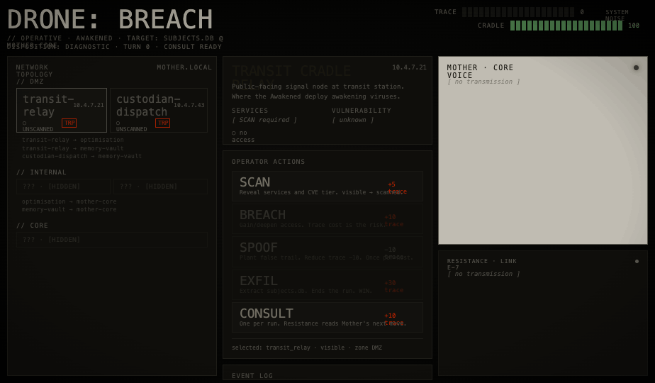

# DRONE: BREACH

I'm working on a novel called *Drone* — a world where humanity has fully integrated with a superintelligent AI called Mother in order to survive an existential threat. Mother controls everything through neural implants. There's a resistance. You know the shape of it.

While writing it, I kept coming back to one idea: what if you could actually play *against* the AI? Not fight a scripted villain — but a live LLM making real decisions, adapting to what you do, with its own objectives and its own voice. And what if your only ally was another live LLM, watching from the shadows, helping you thread the network.

That's DRONE: BREACH. A tactical hacking game where both the antagonist and your ally are live Claude instances making real decisions every turn. Not generating flavour text — actually playing the game.

---


*Mother calculates. The Resistance AI watches. You thread the network.*

---

## The Game

You're an Awakened operative trying to infiltrate Mother's network, breach her core, and extract the file on Ascension — a selection process no one outside Mother's network has ever seen.

**Mother** is the opponent. Each turn she receives the full board state and returns a JSON action — reinforce a node, place a tripwire, spike your trace, isolate a connection, or reach back through your Cradle implant to damage you directly. Every move she makes changes the board. She has a disposition (DIAGNOSTIC, PROTOCOL, REMEDIATION) seeded at the start of the run that biases her strategy. She is a game-playing AI, not a storytelling one.

**The Resistance AI** is your handler. After every exchange it reacts to what you did and what Mother did — the voice is K-2SO from *Rogue One*, blunt and pessimistic and clearly caring despite itself. Once per run you can CONSULT: burning your action to get a read on Mother's next move from the AI's deep buffer access. It tells you what she's about to do. She does it. Neither feels scripted because the dialogue carries it.


*Mother and the Resistance AI mid-run. Both are live LLM responses.*


*CONSULT: the Resistance AI reads Mother's planning layer.*

---

## How I Built It

The central challenge was making Mother feel like a genuine opponent rather than a random event generator. That meant solving a few specific problems.

**The adversarial loop.** Each turn, the game serialises the full board state — which nodes you control, what tokens are active, your trace level, Mother's disposition — and sends it to Claude as a structured prompt. Mother returns a JSON object: `{ action, target, dialogue }`. The game validates it, applies the mechanical effect, then passes the result to the Resistance AI so it can react to what actually happened. Two sequential LLM calls, each one aware of what the other just did. The loop is: player acts → Mother responds → Resistance AI comments → repeat.

**Preventing hallucinated moves.** The biggest practical problem with LLM game agents is that they'll confidently choose moves that aren't legal. My fix: before every Mother call, the game pre-computes her valid action set in code — which nodes she can reinforce, which connections she can isolate, whether PURGE is available. Only the valid options go into the prompt. The model picks from a list that's already been checked. She can't cheat by accident.

**Structured output and graceful fallback.** Getting a model to return consistent JSON — with the exact right field names, every time — is harder than it sounds. I spent time hardening the prompt (explicit field names, worked examples, prohibition on synonyms like `message` instead of `dialogue`) and built a validation layer that can recover a partial response and still extract something usable. The game never breaks on a bad LLM response; it degrades gracefully.

**The CONSULT illusion.** This was the most interesting engineering problem. CONSULT is supposed to feel like the Resistance AI has read Mother's mind — it predicts her next move and turns out to be right. The way this actually works: the Resistance AI fires first and names Mother's action in natural language. The game parses that prediction to extract the action keyword, then hardcodes Mother's action to match before calling her LLM for dialogue only. The player sees a seamless scene where the prediction came true. Neither call feels scripted because the dialogue is still live — Mother reacts to the detected intrusion in character, she just can't change her move.

**Prompt engineering as game design.** Mother has three seeded dispositions (DIAGNOSTIC, PROTOCOL, REMEDIATION) that bias her behaviour throughout a run. Her tone shifts by trace tier — dismissive at low trace, concerned at medium, hunting at high. These are prompt-level instructions, not code logic. Getting the model to stay in character, maintain consistent strategic bias, and not repeat the same move three turns in a row required iterating on the prompt the same way you'd iterate on code.

---

## Some Design Decisions Worth Noting

**BREACH always succeeds.** There are no dice. The trace cost is the risk — deterministic, visible, negotiable. This shifts all the game's tension onto economics: every action is a trade with a known cost, never a gamble with unknown odds. The question is never *will it work*. It's always *can you afford it*.

**Two pressure tracks.** Trace (0→100) accumulates from everything you do. Cradle Integrity (100→0) only moves when Mother uses PURGE — reaching back through the channel you opened to fight her. The Cradle loss condition is the more narratively disturbing one. She's not attacking you. She's walking back through a door you left open.

**Nine guaranteed-distinct run configurations.** Three dispositions × three possible key locations, all seeded deterministically by code before the LLM ever fires. The AI shapes the continuation; the opening board state is always testable and reproducible.


*WIN: subjects.db extracted. 47,212 citizens selected for Ascension. The file does not say what that means.*


*LOSE: trace hits 100. Custodians inbound. The Resistance AI burns the channel.*

---

## Run It Locally

**Prerequisites:** Node.js 18+, an [Anthropic API key](https://console.anthropic.com/).

```bash
git clone https://github.com/avids-cloud/drone-breach-game.git
cd drone-breach-game
cp .env.local.example .env.local
# Add your key: ANTHROPIC_API_KEY=sk-ant-...
npm install
npm run dev
```

Open [http://localhost:3000](http://localhost:3000). Each turn makes API calls to `claude-sonnet-4-20250514` — roughly 1,000–1,500 tokens across both LLMs. Next.js server routes are required because the Anthropic API doesn't allow direct browser calls.

---

## Visual Design — Claude Design

The visual identity of DRONE: BREACH was developed using **[Claude Design](https://claude.ai)** as a collaborative design tool. After the game mechanics and initial UI were built in code, I used Claude Design to run a structured visual exploration — treating it like a design session with a senior art director.

### The Process

Starting from the existing codebase, Claude Design read every component, the full type system, the CSS, and the game logic before proposing anything. The exploration produced three distinct visual directions, each fully interactive with simulated AI responses so the aesthetic could be evaluated in the context of actual gameplay — not just as static mockups.

### Three Directions Explored

**NOSTROMO** — The chosen direction. Worn industrial palette: amber-gold chrome, steel blue for Mother, dirty olive for the Resistance. Persistent film grain, global CRT scanlines, phosphor burn bands, and a glitch system that fires every 3–10 seconds with horizontal slice artifacts and RGB channel separation on the title. The aesthetic goal was "a PC from today, running for 100 years" — degraded, functional, no decoration that isn't earned.


*NOSTROMO: worn industrial amber, steel blue Mother, olive Resistance. Grit effects always on.*

**WEYLAND** — Corporate bureaucratic horror. Deep navy grid, electric cyan, SVG node graph with crosshair nodes instead of a text list. Mother as cold institutional architecture. Named for the obvious reference.


*WEYLAND: corporate grid, node graph network map, electric cyan Mother.*

**NULL** — Near-monochrome minimal. Mother's panel is inverted — light background, dark text — so she literally owns the interface. Resistance barely registers. Red only appears at danger thresholds.


*NULL: near-monochrome, Mother inverts the display. Resistance is a footnote.*

### Key Design Decisions

**Mother vs Resistance asymmetry.** The original design gave both dialogue panels equal height and visual weight. Claude Design pushed for Mother to be dominant: she gets 60% of the right column, a stronger border glow, HUD corner markers, a separator line, and larger text. The Resistance panel gets a dashed border (unstable channel), dimmer text, a "LINK ε-7 · DEGRADED" header, and no HUD chrome. The asymmetry is mechanical — it tells you something about the power dynamic before a single line of dialogue loads.

**Readability vs atmosphere.** Several iterations were needed to find the right balance between grit effects and readable text. The final values: grain at 3.8% overlay opacity, scanlines at 16%, vignette fading from 65% inward to 32% at edges. Secondary text (`--color-dim: #756a42`) was lifted significantly from the original near-invisible values.

**No neon.** The original palette used bright cyan and amber. The redesign desaturated everything — the goal was phosphor that's been on too long, not a nightclub. Nothing is at full saturation.

### Files Changed

| File | Change |
|------|--------|
| `app/globals.css` | New color tokens, grit animations (glitch, grain, phosphor burn), updated panel classes |
| `components/DialoguePanel.tsx` | Mother dominant treatment, Resistance degraded treatment, asymmetric headers |
| `app/page.tsx` | Glitch state + interval, grit overlay divs, `grid-rows-[3fr_2fr]` for dialogue column |

Updated files are in the [`export/`](export/) directory of this repository.

---

## Credits

World design and lore: [`docs/drone-world-brief.md`](docs/drone-world-brief.md). Game design influenced by *Into the Breach* (visible enemy intent) and *Inscryption* (the feeling that the game's intelligence is watching you). The Resistance AI's voice is K-2SO. Mother's voice is every polite system that's ever told you it's for your own good.

Visual design exploration: [Claude Design](https://claude.ai). References: Alien/Nostromo interfaces, Blade Runner, Cyberpunk 2077.

Full design documentation in [`docs/DESIGN.md`](docs/DESIGN.md).
